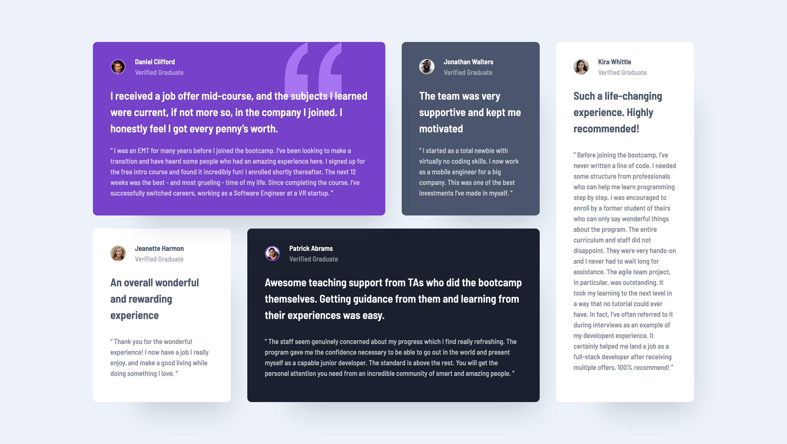

# Frontend Mentor - Testimonials grid section solution

This is a solution to the [Testimonials grid section challenge on Frontend Mentor](https://www.frontendmentor.io/challenges/testimonials-grid-section-Nnw6J7Un7). Frontend Mentor challenges help you improve your coding skills by building realistic projects.

## 目次

-   [概要](#概要)
    -   [チャレンジ](#チャレンジ)
    -   [スクリーンショット](#スクリーンショット)
    -   [リンク](#リンク)
-   [プロセス](#プロセス)
    -   [使用したスキル](#使用したスキル)
    -   [学んだこと](#学んだこと)
    -   [Continued development](#continued-development)
    -   [役に立ったリソース](#役に立ったリソース)

## 概要

### チャレンジ

ユーザーができること:

-   画面サイズによって最適なレイアウトが表示される。

### スクリーンショット



### リンク

-   Live Site URL: [リンク](https://your-live-site-url.com)

## プロセス

### 使用したスキル

-   CSS custom properties
-   Flexbox
-   CSS Grid
-   モバイルファースト

### 学んだこと

・grid-template-areas の使い方について知ることができた。
名前をつけることによって他の人がコードを見ても分かりやすくなるのではないかと思った。

```css
.grid {
	grid-template-areas:
		'daniel daniel jonathan kira'
		'jeanette patrick patrick kira';
}
```

### Useful resources

-   [リソース 1](https://developer.mozilla.org/ja/docs/Web/CSS/grid-template-areas) - このサイトで grid-template-areas の使い方を学ぶことができた。
